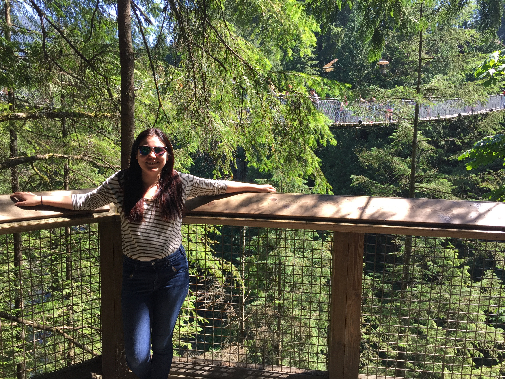

MS Biostatistics Candidate   
Columbia University Mailman School of Public Health

### About Me

In 2014, I received a BS in Ecology and Evolutionary Biology and a BS in Environmental Science from the University of Arizona. After working as an ecological research assistant in the Rocky Mountains and coastal rainforests of Ecuador and snowboard-bumming in Denver, I decided to channel my passion for science into pursuing an MS in Biostatistics at Columbia University. You can see examples of what I've learned so far [here](flexdashboard.html)!

